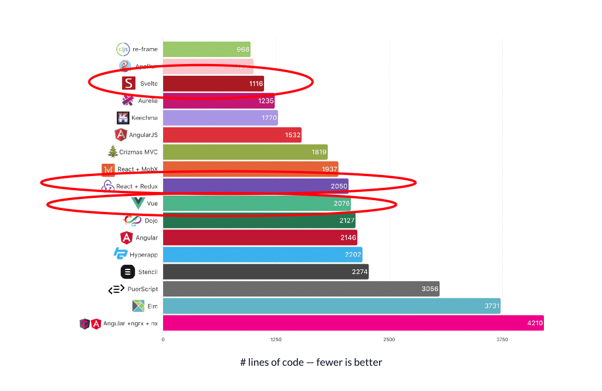
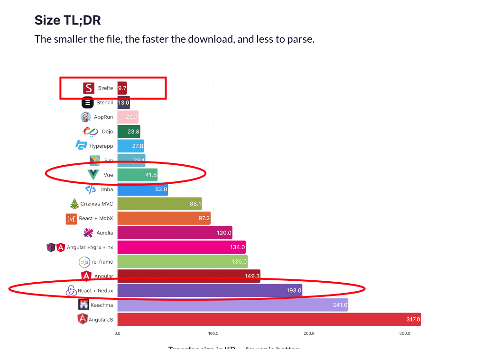
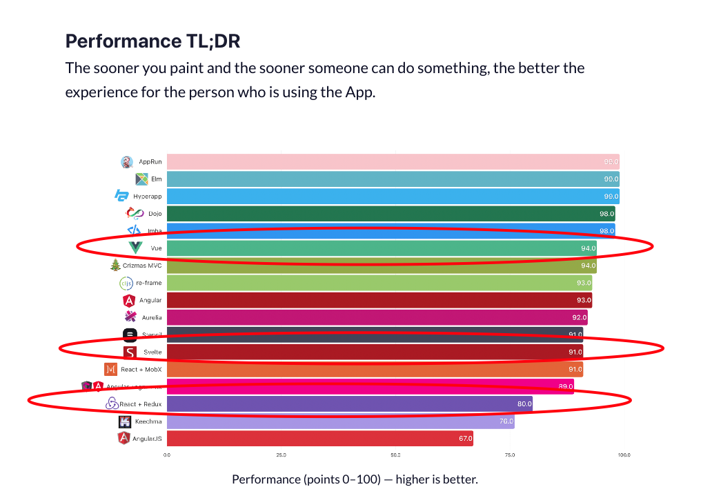
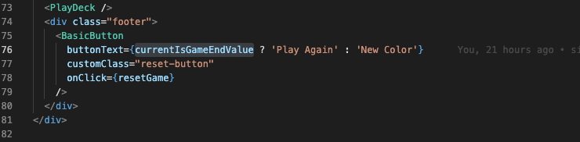
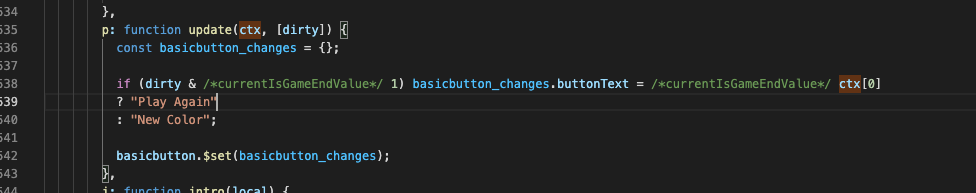
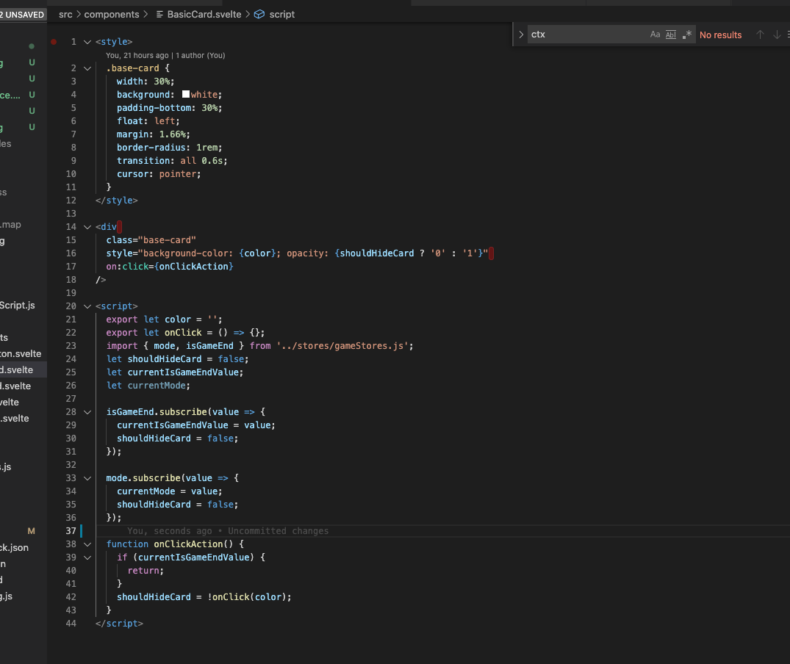

# OutLine

### 1. Main Concept
### 2. Pros
### 3. Cons
### 4. Simple Demo
### 5. Q & A

---

# Main Concept

### 1. Less Code
- easier syntax for delcaration, data-binding, render syntax etc
### 2. No VirtualDom
- compile essential function during build time. (In fact, still some run time code to distpatch, diff the state change)
### 3. True Reactive
- 
---

---

---

---
# Pros

1. much better performance in small application
   - no extra diff like Virtual DOM, directly decide the specfic dom to update
2. much simple syntax to declare (depends on developer)
3. Bundle file could exlcude framework code
   - the relating code is compiled during build time.
---

# Sample code

---

---

# Cons

1. If the svelete could apply in real-life large-scale application is questionable.
2. The community isn't strong as other frameowrks.
3. The size of bundle from svelete need to be confirmed if it's smaller than other frameworks in large-scale application.

---

# Demo
---
# Reference

https://svelte.dev/
https://www.freecodecamp.org/news/a-realworld-comparison-of-front-end-frameworks-with-benchmarks-2019-update-4be0d3c78075/
https://juejin.cn/post/6844904100656578567

---
